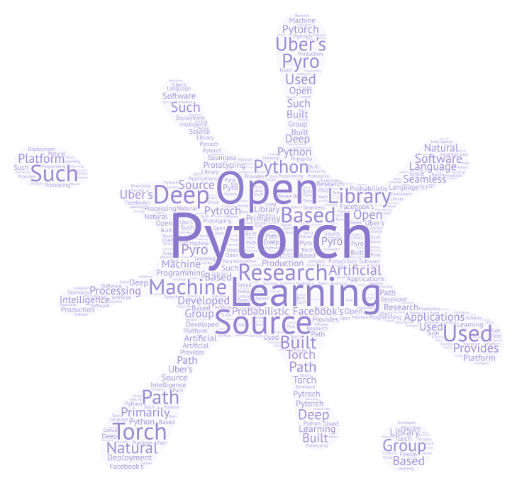

# awsome-pytorch
This project aims to develop a useful resource for learning Deep Learning and Reinforcement Learning using Pytorch. It conatins code from basic to advance level. 

## Plan ##

### Beginner ###
1. Pytorch Basic
2. Linear Regression
3. Logistic Regression
4. Feed Forward Neural Netwrok 

### Intermediate ###
1. Convolutional Neural Network
2. Deep Recurrent Neural Network 
3. Bidirectional LSTM
4. Cross-Lingual Word Vectors

### Advance ###
1. Variational Auto-encoder Decoder 
2. GANS
3. Style Transfer 
     1.  For Images 
     2.  For Text
4. Caption Generator
5. Image Segmentation

Note : Plan for RL is  yet to decide 

## Dependencies ##

**Recommended**

python 3 and pytorch >= 0.4 

## Author ##

Vedic Partap
